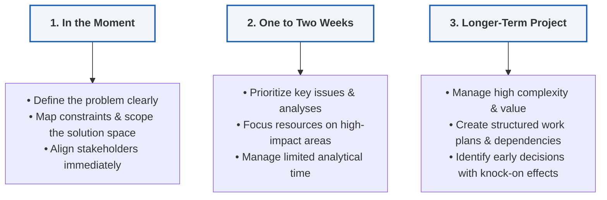

# Module 1: Making Sense of Problems

_Key Insights from McKinsey Forward Program - Lesson 5_

---

## Learning Objectives
_Estimated Study Time: 5 minutes_

In this lesson, you will learn how to:
* **Categorize problems** based on three distinct time horizons.
* **Adapt your problem-solving approach** to match immediate, short-term, and long-term constraints.
* **Determine key areas of focus**—from stakeholder alignment to issue prioritization and detailed work planning.

---

## The Time Horizon Framework

As a professional, you are constantly surrounded by problems. One of the most practical ways to organize your approach is to consider your **time horizon**—how much time you actually have to grapple with the problem and arrive at a recommendation.

> [!NOTE]
> Different timeframes dictate which aspects of the problem-solving process you should prioritize. The framework breaks these down into three horizons:

### Detailed Breakdown of the Time Horizons

*   **1. In the Moment (Immediate)**
    *   **Approach:** You lack the time to formally document steps or use complex tools. 
    *   **Key Focus:** Test the problem definitions mentally. Have you truly defined the core issue? Are all stakeholders aligned? Is the solution space properly scoped under current constraints?
*   **2. One to Two Weeks (Short-Term)**
    *   **Approach:** You have enough time to conduct some analysis, but you cannot investigate everything.
    *   **Key Focus:** Prioritization is paramount. Carefully select the critical issues and focus only on the analyses that yield the highest impact.
*   **3. Longer-Term Projects (Long-Term)**
    *   **Approach:** You have a longer window, but this usually introduces higher complexity and significant value at stake.
    *   **Key Focus:** Structured work planning. You must define dependencies, align stakeholders early, and make foundational decisions that prevent negative knock-on effects later in the project lifecycle.
