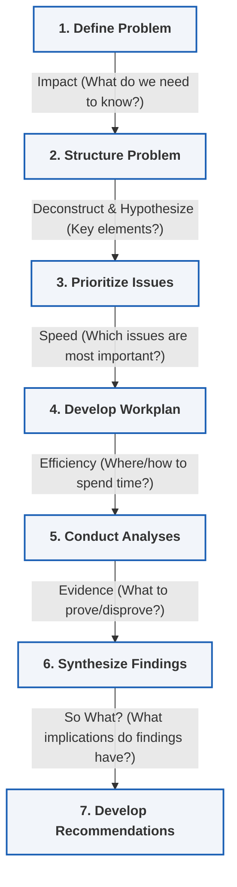

# Module 2: Hypothesis-Led Problem Solving

_Key Insights from McKinsey Forward Program - Lesson 11_

---

## Learning Objectives
_Estimated Study Time: 5 minutes_

In this lesson, you will learn how to:
* **Define** the hypothesis-led approach for structured problem solving.
* **Contrast** the analytical "science" and creative "art" of problem solving.
* **Identify** the 7 key steps of the hypothesis-led approach.

---

## The Hypothesis-Led Problem Solving Approach

While there are several approaches to problem solving, the hypothesis-led approach is one of the most flexible and widely applicable. It can be used in most situations to help you break down hard, ambiguous problems to find the best solutions quickly.

> [!NOTE]
> The **hypothesis-led approach** is a structured methodology that requires formulating a hypothesis upfront, structuring the work to test that hypothesis, and iterating based on communication. It is highly suitable for tasks requiring **convergent thinking**.

### Detailed Breakdown of the 7-Step Process

*   **1. Define Problem**
    *   Focus on **Impact**: What do we need to know?
    *   Formulate a clear and focused problem statement upfront.
*   **2. Structure Problem**
    *   Focus on **Deconstruction**: Break the problem down into smaller, manageable pieces (e.g., using issue trees).
    *   Formulate early hypotheses about the key elements.
*   **3. Prioritize Issues**
    *   Focus on **Speed**: Determine which issues are the most critical to solve first to make rapid progress.
*   **4. Develop Issue Analysis / Workplan**
    *   Focus on **Efficiency**: Plan where and how the team should spend their time and resources.
*   **5. Conduct Analyses**
    *   Focus on **Evidence**: Gather facts and conduct analysis to prove or disprove the hypotheses.
*   **6. Synthesize Findings**
    *   Focus on **"So What?"**: Interpret findings to understand their implications rather than just presenting raw data.
*   **7. Develop Recommendations**
    *   Focus on the **Potential Solution**: Formulate actionable recommendations on what steps to take.

---

## The Art and Science of Problem Solving

The hypothesis-led approach provides a structure that balances analytical rigor with creative collaboration:

*   **The Science (Analytical Rigor)**
    *   Provides a highly structured process to tackle large, complex, and ambiguous issues.
    *   Systematically breaks down the problem to get to an actionable recommendation.
*   **The Art (Creative Tension & Collaboration)**
    *   Encourages creative collaboration and healthy debate (e.g., comparing and iterating on different versions of an issue tree).
    *   Relies heavily on continuous communication and iteration throughout the process.
    *   **Accessibility:** Scales nicely and does not require extensive prior expertise, making it usable by anyone.

---

## Exploring Practical Use Cases

Reflect on how this approach scales and applies to both business and everyday scenarios.

### 1. Business Application: Mergers & Acquisitions (M&A)
*   **Scenario:** A company is deciding whether to make a major investment, such as acquiring another business.
*   **Characteristics:** A broad, high-stakes question with limited initial data/expertise, but with a binary outcome (either you acquire or you don't).
*   **Applying the Approach:** 
    *   Start with the fundamental question: *Should we acquire this company?*
    *   Establish clear upfront hypotheses.
    *   Structure the problem by breaking it down into component parts (financial health, market fit, culture).
    *   Prioritize key areas and run targeted analyses to prove/disprove the hypothesis quickly.

### 2. Everyday Application: Choosing a Market Purchase
*   **Scenario:** A simple decision like deciding which high-value household item or vehicle to buy.
*   **Applying the Approach:**
    *   Define the problem: *Which purchase offers the best value and fits my needs?*
    *   Formulate early hypotheses based on initial thoughts (e.g., *"Model A is the best choice because it has the highest reliability rating"*).
    *   Prioritize key issues (e.g., safety, budget, longevity).
    *   Gather targeted evidence (reviews, specifications) to verify or refine your hypothesis before making the decision.
