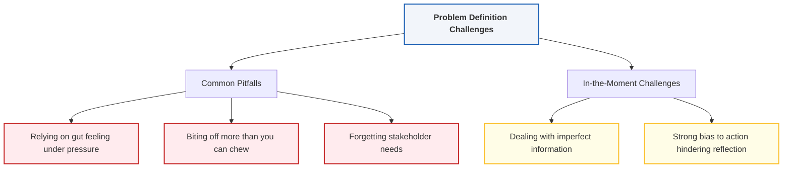

# Module 3: The Power of Problem Definition

_Key Insights from McKinsey Forward Program - Lesson 15_

---

## Learning Objectives
_Estimated Study Time: 8 minutes_

In this lesson, you will learn how to:
* **Explain** why defining the problem is the first and most critical step in problem solving.
* **Identify** common pitfalls that prevent teams from solving the right problem.
* **Distinguish** between different types of in-the-moment decisions (crisis vs. ad-hoc).
* **Understand** the balance between the bias to action and slowing down to align on problem definition.

---

## The First Critical Step: Problem Definition

Every problem-solving process—whether it is a long-term project or an in-the-moment decision—starts with defining the problem. If you fail to define it correctly, you risk finding the right solution to the wrong problem.

> [!NOTE]
> Defining the problem involves articulating precisely what you are trying to solve and aligning stakeholders on what success looks like. It is often the most challenging step because individuals view problems and success criteria differently.

### Pitfalls to Avoid Upfront

*   **Relying on Gut Feelings:** Making fast, intuitive judgments under high pressure without questioning assumptions.
*   **Biting Off More Than You Can Chew:** Attempting to solve a problem that is too large or requires more resources than available.
*   **Ignoring Stakeholder Needs:** Failing to align the problem definition with the actual needs and priorities of the target audience.

---

## Decision-Making Horizons

While long-term projects allow for systematic, upfront alignment, "in-the-moment" decisions present unique challenges and can be split into two distinct categories:

### 1. Urgent Crisis Decisions
*   **Characteristics:** High-stress, high-intensity, high-urgency, and high-consequence situations.
*   **The Challenge:** Teams often have a strong **bias to action**, which pushes them to implement solutions immediately.
*   **The Solution:** Forcing a team to stop, slow down, and align on the problem definition is critical. Action without definition leads to misaligned and ineffective solutions.

### 2. Ad-Hoc Decisions
*   **Characteristics:** High-frequency but lower-consequence situations.
*   **The Challenge:** It is easy to take alignment for granted, assuming everyone is on the same page when they might not be.

---

## Practical Case Studies

### Case Study 1: Pricing a New Product
*   **The Initial Question:** *What price should we set for this new product?* (Seems simple and well-defined).
*   **The Problem Definition Debate:** Different stakeholders have conflicting definitions of success:
    *   *Marketing Team:* Price low to maximize rapid user adoption and market penetration.
    *   *Finance Team:* Price high to maximize immediate profit margins.
*   **Key Lesson:** Alignment on the core objective must happen before deciding on the price, otherwise the pricing strategy will fail to satisfy any goal.

### Case Study 2: The 3:00 AM Cruise Line Crisis
*   **The Scenario:** A cruise line suffered a series of major ship catastrophes, prompting an urgent 3:00 AM call to advisors.
*   **The Alignment Challenge:** The response team initially had different interpretations of the core problem:
    *   *Safety Focus:* How do we protect and rescue endangered passengers?
    *   *Operational Focus:* How do we get the ships running to minimize downtime?
    *   *Reputational Focus:* How do we restore trust in the brand?
*   **Key Lesson:** Defining which of these questions was the primary problem was essential, as each definition led to completely different action plans.