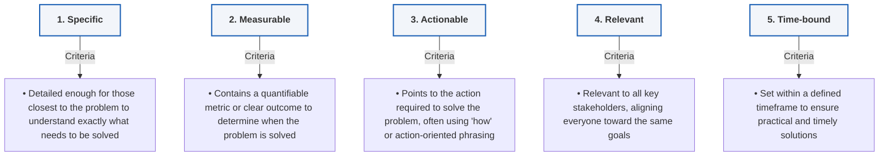

# Module 3: SMART Problem Definition

_Key Insights from McKinsey Forward Program - Lesson 18_

---

## Learning Objectives
_Estimated Study Time: 5 minutes_

In this lesson, you will learn how to:
* **Understand the SMART framework** and why it is critical for defining clear problem statements.
* **Evaluate and test** problem questions against Specific, Measurable, Actionable, Relevant, and Time-bound criteria.
* **Iteratively refine** a basic question into a high-impact, SMART problem question.

---

## The SMART Framework for Problem Questions

After summarizing and defining the problem in one specific "problem question" or "problem statement," the next step is to put it to the test. Pushing for a SMART problem question can have a large impact on your problem-solving efforts, clarifying the challenge and defining what it really means to address it.

> [!NOTE]
> A robust problem question provides the necessary foundation for any problem-solving effort by meeting the five **SMART** criteria:

### Detailed Breakdown of SMART Criteria

*   **Specific**
    *   Is the question specific enough?
    *   Your problem question needs to be detailed enough so that those who are closest to the problem can understand exactly what needs to be solved.
*   **Measurable**
    *   A measurable result will be instrumental in helping you determine that the problem is truly solved.
    *   This should be a quantifiable number or a clear binary metric.
*   **Actionable**
    *   The problem question should point to the action required to solve the problem.
    *   It usually includes words like "how" or outlines the actions that need to be taken.
*   **Relevant**
    *   Your problem question should be relevant to everyone involved—the executive, your team, and any other stakeholders.
    *   It is crucial to align everyone so they share the same goals.
*   **Time-bound**
    *   Problem questions should always be time-bound.
    *   This ensures that everyone develops solutions that are practical within the defined timeframe.

---

## Case Study & Iterative Refinement: DentMerc

Defining a problem is an iterative process. Let's see how a team can apply the SMART framework to refine their focus.

### The Scenario
Recall that DentMerc's Marketing VP, Arun, is conducting a quick review of his team’s marketing research proposal for their CEO. After a brief discussion, the team agrees on an initial question:

> **Initial Question:**
> *"Should DentMerc enter the well-established Southeast Asian toothbrush market with a new product, the Click\*Brush?"*

### SMART Evaluation (Expert Analysis)

*   **Specific**: **Partially Met.** The question is relatively specific—it specifies entering a particular market (Southeast Asian toothbrush) with a particular product (Click\*Brush).
*   **Measurable**: **Partially Met.** It offers a binary decision ("yes, enter" or "no, don't enter"). As the team dives deeper, they can introduce more specific success metrics.
*   **Actionable**: **Met.** Once answered, the company will take action to either enter or not. The next step is to break down the critical factors behind this "go/no-go" decision.
*   **Relevant**: **Met.** The team has clearly defined the relevant actor and beneficiary (DentMerc).
*   **Time-bound**: **Not Met.** The timeline for arriving at a recommendation or making the decision is completely unspecified.

### The Refined SMART Question

By addressing the missing and weak elements (especially the timeframe and action factors), we can formulate a much stronger question:

> **Improved SMART Question:**
> *"What market research can we gather and analyze in a one-month time frame that will best help us determine whether DentMerc should enter the well-established Southeast Asian toothbrush market with a new product, the Click\*Brush?"*

> [!TIP]
> As the team continues to discuss and align, they may refine the question even further. Do not treat problem definition as a one-step task—it is an iterative process.
