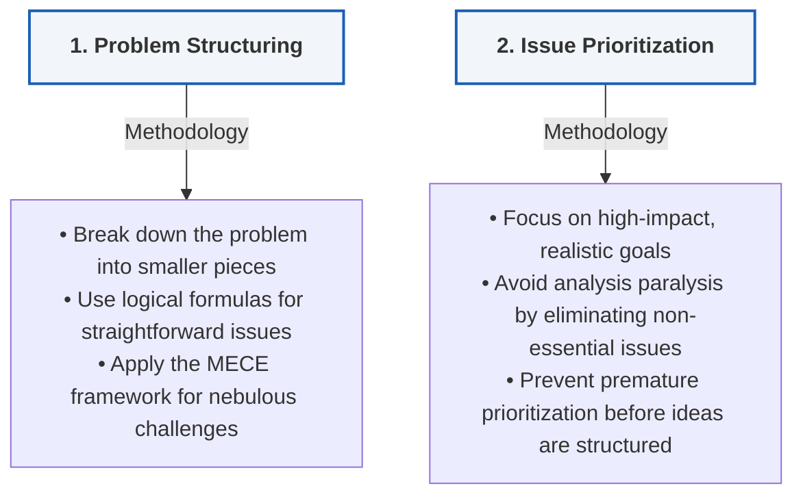

# Module 4: Structuring the Problem & Prioritization

_Key Insights from McKinsey Forward Program - Lesson 26_

---

## Learning Objectives
_Estimated Study Time: 6 minutes_

In this lesson, you will learn how to:
* **Define problem structuring** and understand how to break down complex issues into manageable parts.
* **Apply the MECE framework** (Mutually Exclusive and Collectively Exhaustive) to structure nebulous problems.
* **Prioritize issues effectively** to focus limited time and resources on high-impact areas.
* **Balance the interplay** between structuring and prioritization to avoid premature elimination of critical ideas.

---

## Structuring and Prioritizing Problems

Once you have defined a SMART problem question, the next phase in the hypothesis-led problem-solving approach is to **structure the problem** and **prioritize key issues**. In the real world, you will almost always lack the time to address every single aspect of an inquiry. How you structure and prioritize determines whether you spend your limited resources on the right areas.

> [!NOTE]
> Structuring and prioritization form the bridge between defining a problem and executing the analyses that solve it.

### Detailed Breakdown of the Process

*   **Problem Structuring**
    *   **Definition:** Simply breaking down a problem into its smaller, component pieces.
    *   **Straightforward vs. Nebulous Problems:** 
        *   *Straightforward:* Standard problems (like profit optimization) have well-traveled formulas (e.g., Profit = Revenues - Costs).
        *   *Nebulous:* Broad questions (like eradicating a disease or reversing declining classical music listenership) do not have a single correct structure.
    *   **The MECE Principle:** Regardless of complexity, the process remains the same: break the problem into relevant components that are **Mutually Exclusive and Collectively Exhaustive (MECE)**.
    *   **An Iterative Balance:** Structuring is a balance between art and science. Like problem definition, it is an iterative process; there is rarely only one single right answer.

*   **Issue Prioritization**
    *   **The Challenge:** Time is a hard constraint. If you have 100 structured issues and simply work from the top down, you will run out of time (e.g., stopping at number 37).
    *   **Analysis Paralysis:** Trying to tackle all issues at the same time dilutes your focus and prevents you from reaching a solid conclusion.
    *   **The Interplay (Avoid Premature Pruning):** Avoid prioritizing too soon in the structuring phase. Eliminating potential avenues of analysis too quickly might lead you to discard critical pathways that could lead to the best answer.
    *   **Key Focus:** Prioritize based on what will have the **most impact** and what is **achievable in the timeframe** you have.
