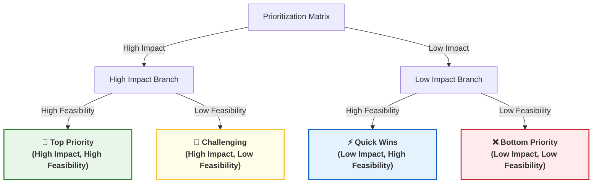

# Module 4: Prioritizing Issues with 80/20 & the Prioritization Matrix

_Key Insights from McKinsey Forward Program - Lesson 30_

---

## Learning Objectives
_Estimated Study Time: 10 minutes_

In this lesson, you will learn how to:
* **Understand the 80/20 rule** (Pareto Principle) and how it prevents "boiling the ocean" during research.
* **Manage ambiguity and precision** based on the context of your problem.
* **Classify issues** using a 2x2 prioritization matrix based on impact and feasibility.
* **Adapt your prioritization approach** for both short-term (in-the-moment) and long-term project horizons.

---

## The 80/20 Rule (Pareto Principle)

Once you have built out your issue tree, you will likely have a large number of issues to investigate but very little time to do so. The Pareto principle, or 80/20 rule, is a critical technique to help prioritize your focus.

> [!NOTE]
> The **80/20 rule** states that you typically get **80% of the benefits or insights** from **20% of the work**. It acts as a guide to prompt you to focus on the key analyses that will lead to the solution most quickly.

### Key Considerations for Applying 80/20:
*   **Embracing Ambiguity:** Applying the 80/20 rule means being comfortable with being directionally correct rather than 100% precise. Always ask: *Do we have a sufficient level of detail to make a decision and move forward?*
*   **Context-Dependent Precision:**
    *   *High Ambiguity (Directional):* When sizing a new market, knowing whether it is a $10M or $100M opportunity is often sufficient.
    *   *High Precision:* In areas like semiconductor manufacturing error rates, you may need multiple decimal levels of precision.
*   **Iterative Prioritization (Longer Horizons):** On longer projects, keep reviewing your prioritization. If an analysis disproves a key hypothesis, you can immediately eliminate that entire branch of your issue tree and save time.

---

## The Prioritization Matrix

When you need to prioritize issues or analyses, plotting them on a 2x2 matrix based on **Impact** and **Feasibility** is one of the most effective techniques.

### Detailed Breakdown of the Matrix Quadrants

*   **High Impact & High Feasibility (Top Priority)**
    *   Place at the top of your to-do list.
    *   Delivers high value with the least amount of effort or resources.
*   **High Impact & Low Feasibility (Challenging)**
    *   Requires critical decision-making: How confident are you that this is necessary?
    *   Can we relax some constraints or redefine the problem to make this more feasible?
*   **Low Impact & High Feasibility (Quick Wins)**
    *   Useful in the early stages to show progress, build momentum, and answer simpler questions quickly.
*   **Low Impact & Low Feasibility (Bottom Priority)**
    *   Place at the bottom of the list or eliminate entirely to save resources.

---

## Practical Application Examples

### 1. The 80/20 Rule: Valuing a Multi-Line Business
*   **Scenario:** A project team needs to value a large corporation with over 200 distinct lines of business.
*   **The Pitfall:** Trying to perform a detailed valuation for all 200 lines individually, which is impossible within the timeline.
*   **The Solution:** The team identified **30 key lines of business** (approx. 15% of the total) that accounted for the vast majority of the company's valuation. Focusing only on these 30 lines allowed them to deliver a highly accurate valuation on time.

### 2. Prioritization Matrix: Adapting to Project Horizons
*   **Short-Term / In-the-Moment Decisions:**
    *   *Approach:* Keep it simple. Use relative "T-shirt sizing" (Small, Medium, Large) or High/Medium/Low rankings.
    *   *Goal:* Make rapid, directional decisions without getting bogged down in numeric models.
*   **Long-Term Projects:**
    *   *Approach:* Invest time upfront. Define specific drivers of feasibility (time, budget, tech risk) and use analytical tools to quantify impact.
    *   *Goal:* Achieve a highly precise, ranked list of issues to guide weeks or months of team effort.