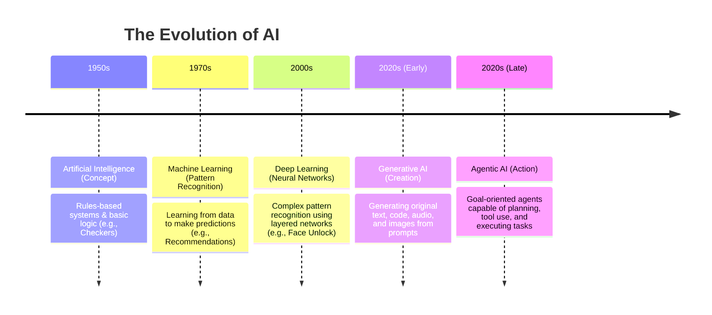

# The Journey to Generative AI

_Key Insights from McKinsey Forward Program - Lesson 16_

Artificial Intelligence has evolved over decades, progressing through distinct technological waves. Understanding this evolution helps clarify how early conceptual ideas laid the groundwork for the generative breakthroughs of today.

---

## Timeline of AI Evolution

### 1. 1950s: Artificial Intelligence (Concept)
The foundational concept of machines performing tasks that typically require human intelligence, such as logical deduction, speech recognition, and decision-making.
* **Core Capability:** Follows structured rules and logic to execute specific tasks.
* **Real-world Example:** AI learning to play checkers and calculating optimal board moves.

### 2. 1970s: Machine Learning (ML)
A subset of AI that allows machines to identify patterns and predict future outcomes by training on historical data. These predictions improve over time as the system is exposed to more data.
* **Core Capability:** Learns from data to make decisions with minimal human intervention.
* **Real-world Example:** Recommending movies by analyzing patterns across thousands of user ratings.

### 3. 2000s: Deep Learning (DL)
A specialized form of ML inspired by the neural pathways of the human brain. Multi-layered neural networks process inputs, perform calculations, and pass results forward to identify highly complex patterns.
* **Core Capability:** Understands raw, unstructured data (images, voice, natural language) through hierarchical pattern recognition.
* **Real-world Example:** Powering facial recognition technologies to unlock mobile phones instantly.

### 4. 2020s: Generative AI (Gen AI)
A branch of deep learning that moves beyond analyzing inputs to producing completely new, original outputs (text, images, audio, video, or code) based on its training.
* **Core Capability:** Synthesizes patterns to generate creative, original content from textual prompts.
* **Real-world Example:** Generating high-resolution digital artwork, music tracks, or complete source code blocks.

### 5. 2020s & Beyond: Agentic AI
An emerging frontier where AI moves from simple prompt-and-response assistance to goal-directed, autonomous action. Agents can plan tasks, call external tools, and execute workflows independently.
* **Core Capability:** Autonomously plans and executes multi-step workflows to achieve a defined objective.
* **Real-world Example:** Resolving a customer order dispute end-to-end by checking shipment tracking, issuing a refund, and emailing confirmations.

---

## Traditional AI vs. Generative AI

Understanding the distinction between these two paradigms is essential for determining the right tool for a given business challenge.

| Dimension | Traditional AI | Generative AI |
| :--- | :--- | :--- |
| **Primary Goal** | **Analyze & Predict:** Recognizes patterns to classify, forecast, or make decisions. | **Create & Synthesize:** Generates entirely new content and outputs. |
| **Mechanics** | Evaluates input data against defined rules or mathematical patterns. | Learns structural patterns to generate plausible new instances of data. |
| **Outputs** | Labels, classifications, scores, predictions, or recommendations. | Written copy, code, images, audio, video, and structured reports. |

### Traditional AI in Action
Traditional AI excels at structured classification and prediction tasks:
1. **Email Filtering:** Classifying incoming emails as spam or focused inbox items.
2. **Fraud Detection:** Monitoring bank transactions in real time to spot and flag anomalous spending patterns.
3. **Product Recommendations:** Serving personalized product suggestions to e-commerce customers.

### Generative AI in Action (High-Impact Workflows)
Gen AI is redefining how industries operate by automating content-heavy and creative workflows:
1. **Automated Software Engineering:** Generating, debugging, and explaining complex programming code or translating between languages.
2. **Marketing & Copywriting:** Instantly creating targeted advertising copy, email campaigns, and social media posts tailored to different customer personas.
3. **Executive Synthesis & Reporting:** Analyzing raw documents or transcripts to generate executive summaries, presentation outlines, and reports.

---

## McKinsey & QuantumBlack Context

To help organizations scale these technologies, McKinsey leverages **QuantumBlack, AI by McKinsey**—a specialized service line that works across the entire lifecycle, from strategy to large-scale deployment.

While QuantumBlack operates at an enterprise scale, this module focuses on **foundational principles and practical applications** that individuals and teams can implement immediately to drive value in their daily workflows.
