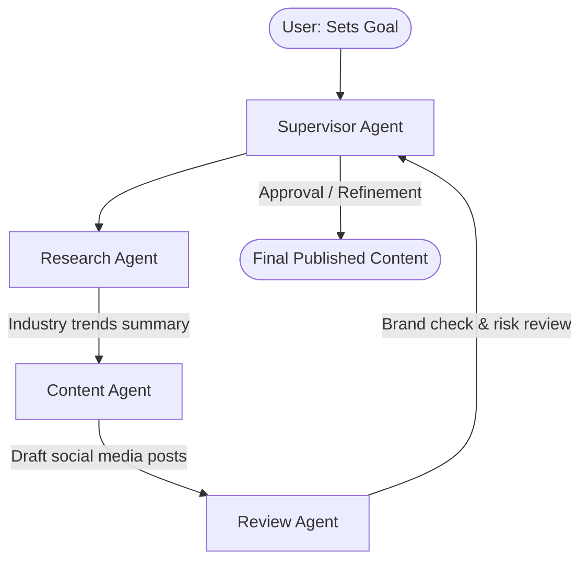

# Understanding Agentic AI

_Key Insights from McKinsey Forward Program - Lesson 17_

Agentic AI represents a paradigm shift from passive prompt-and-response assistants to active virtual coworkers. By reasoning, planning, and executing actions autonomously, it moves beyond content creation to run end-to-end business processes.

---

## Gen AI ("Tell or Show Me") vs. Agentic AI ("Do It for Me")

While standard Generative AI excels at answering questions and creating one-off assets, Agentic AI acts as a goal-oriented problem solver.

| Dimension | Generative AI ("Tell/Show Me") | Agentic AI ("Do It for Me") |
| :--- | :--- | :--- |
| **Operational Mode** | Single, isolated interactions (step-by-step). | Multi-step, continuous workflows toward a goal. |
| **Autonomy** | Requires constant human guidance and new prompts. | Reasons, decides, and executes next steps independently. |
| **Tool Integration** | Limited to generating responses within its chat window. | Uses external tools (APIs, databases, calendars) on its own. |
| **Memory & Adaptability** | Limited context window per session. | Remembers past tasks to guide future actions; learns from the environment. |

---

## Multi-Agent Workflows

The most advanced Agentic AI systems employ a **multi-agent architecture**, where specialized digital agents collaborate under the guidance of a **Supervisor Agent**.

### Case Study: Automating Social Media Updates
Rather than a user manually prompting a Gen AI tool to write posts day after day, a multi-agent system automates the entire process end-to-end:

1. **Research Agent:** Scans the web for industry-specific news, filters trending topics, and outputs a summary of 3–5 key items.
2. **Content Agent:** Converts the summary list into drafted posts tailored for different platforms (e.g., LinkedIn, Twitter, Instagram), automatically adjusting tone and style.
3. **Review Agent:** Analyzes the drafts for correct grammar, brand voice alignment, and flags potential risks (e.g., sensitive topics or unverified claims).
4. **Supervisor Agent (Orchestration):** Oversees the workflow, directs tasks between agents, and prepares the final drafts for human approval or direct publishing.

---

## Where Agentic AI Reshapes Work

Agentic AI is highly effective in departments with clear, rule-based processes:

- **Sales & Marketing:** Automating lead generation, scoring, and personalized nurture campaigns.
- **Customer Support:** Resolving customer disputes, processing refunds, and tracking orders end-to-end.
- **Human Resources (HR):** Standardizing new employee onboarding workflows and managing internal requests.

---

## The Human Element: Empathy & Judgment

Despite the high level of autonomy Agentic AI offers, human involvement remains the critical component of its success:

- **Business Rationale:** Every AI deployment must start with a human-defined strategic purpose.
- **Trust & Understanding:** Teams must thoroughly understand the workflows they are handing over to AI agents.
- **Empathy and Oversight:** Humans provide the essential empathy, moral reasoning, and complex judgment calls that machines cannot replicate.