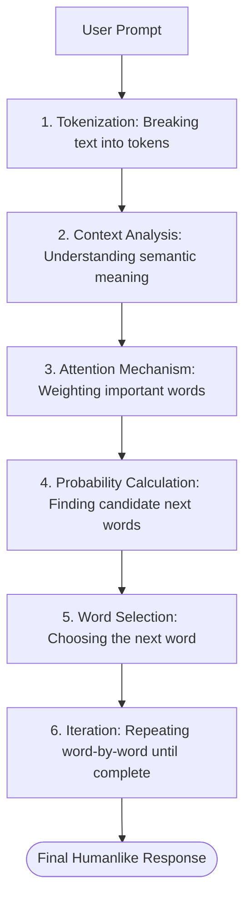

# How Generative AI Works

_Key Insights from McKinsey Forward Program - Lesson 18_

To work effectively with Generative AI, it helps to understand the underlying mechanics of how these tools process prompts and construct responses. Rather than reciting answers from memory, they build responses dynamically using probability.

---

## Large Language Models (LLMs) at the Core

Generative AI tools (such as chatbots, writing assistants, and code generators) are powered by **Large Language Models (LLMs)**.

* **Training Data:** LLMs are trained on massive datasets including books, websites, articles, and code repositories.
* **Pattern Recognition:** By analyzing billions of sentences, the model learns how words relate to each other and maps grammatical and semantic rules.
* **Real-time Generation:** When a user enters a prompt, the LLM constructs an answer token-by-token in real time, serving a "best-guess" sequence based on its training.

---

## Step-by-Step: How Responses Are Generated

Below is the conceptual journey of how a prompt transforms into a humanlike response:

1. **Prompt Input:** The user provides text instructions or a question.
2. **Tokenization:** The AI breaks the text down into smaller pieces called "tokens" (which can be whole words, syllables, or characters).
3. **Contextual Embedding:** Tokens are mapped to vectors (numerical values) to represent their semantic meaning and relationships.
4. **Attention Mechanisms:** The model analyzes the prompt, prioritizing which words or context clues are most important to the query.
5. **Probability Calculation:** The model checks its vocabulary database to determine the most likely next words that would logically follow the input text.
6. **Word Selection:** Using internal settings (such as "temperature" or creativity levels), it selects the next word.
7. **Iteration (Word-by-Word Generation):** The selected word is added to the prompt, and the process repeats to predict the next word.
8. **Output Decoding:** The completed sequence of tokens is converted back into natural, human-readable text and displayed to the user.

---

## Predictive vs. Deterministic Systems

A common misconception is that AI functions like a traditional computer program or calculator.

| Dimension | Deterministic Systems | Predictive (Generative) Systems |
| :--- | :--- | :--- |
| **Output Nature** | **Fixed & Consistent:** Always gives the exact same output for the same input. | **Flexible & Creative:** Can generate different outputs for the identical prompt. |
| **Operational Logic** | Executes hardcoded mathematical or logical rules. | Predicts the most statistically likely next word. |
| **Example** | A calculator: `2 + 2` will always equal `4`. | A writing assistant: Drafting a marketing email can result in various creative options. |

---

## Actionable Takeaways for Professionals

Understanding the predictive nature of Gen AI helps you use it more effectively:

- **Verify Precise Facts:** Since Gen AI predicts likely words rather than pulling verified records, always double-check facts, calculations, and references.
- **Embrace Variation:** Do not lose trust if a tool gives a slightly different answer upon regenerating. Varied responses are a sign of the model's creative flexibility.
- **Compare and Synthesize:** Run the same prompt through different models or tools to compare outputs and synthesize the best components to form your own perspective.