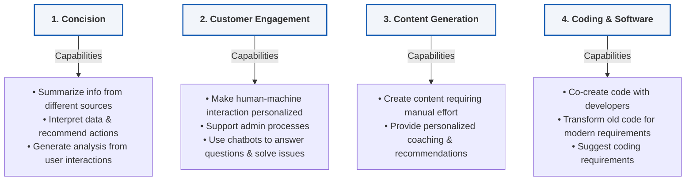

# Module 3: Generative AI Use Cases & Objectives

_Key Insights from McKinsey Forward Program - Lessons 22 & 23_

---

## Learning Objectives
_Estimated Study Time: 10 minutes_

In this module, you will learn how to:
* **Recognize use cases** for Gen AI in everyday life, the workplace, and at the organizational level.
* **Categorize tasks** into those suitable vs. unsuitable for Gen AI use.
* **Understand transformation:** Recognize how AI, when combined with other technologies, can transform industries and daily life.

---

## A Framework for Gen AI Use Cases

So far, we’ve looked at what Gen AI is and how it works. But what does it actually mean for you, your workplace, or the organizations around you? 

To answer that, let’s explore four areas where Gen AI is being used frequently. Use cases are multiplying quickly and expanding into new domains every day, opening up possibilities that go far beyond what we can imagine right now.

> [!NOTE]
> Gen AI is most frequently being used in four broad ways, outlined in **McKinsey’s 4C Framework for Generative AI Use Cases**:

### Detailed Breakdown of the 4C Capabilities

*   **Concision**
    *   Summarize information from different sources.
    *   Interpret data and recommend actions.
    *   Generate analysis from user interactions.
*   **Customer Engagement**
    *   Make human-machine interaction more personalized and effective.
    *   Support people, companies, or institutions with administrative processes.
    *   Use chatbots to answer questions and solve issues.
*   **Content Generation**
    *   Create content (text, images, sound, designs, etc.) that previously required manual effort.
    *   Provide personalized coaching and recommendations to users.
*   **Coding & Software**
    *   Co-create code with developers.
    *   Transform old code for modern requirements.
    *   Suggest coding requirements.

---

## Exploring Practical Use Cases

As you explore some examples of practical applications under each category, reflect on whether these applications or similar ones could be relevant to you or your organization.

### 1. Concision in Action
*   **Jane** summarizes thousands of user reviews about a new car before making a purchase.
*   **An architect** uses Gen AI to instantly create simplified floor plan diagrams from detailed building designs.
*   **A consulting company** builds a corporate knowledge base of all the projects it worked on to date, to codify learnings.
*   **An accountant** condenses a complex financial dashboard into a simple infographic with key highlights.

### 2. Content Generation in Action
*   **A podcaster** uses Gen AI to draft an episode outline and generate a synthetic voice track.
*   **A filmmaker** co-creates a video storyboard with Gen AI generating draft scripts, scene visuals, and dialogue.
*   **A marketing team** produces a multilingual campaign with Gen AI generating copy, images, and localized video snippets.
*   **An architect** co-designs a new building concept with Gen AI generating draft floor plans, 3D visualizations, and sustainable material options.

### 3. Customer Engagement in Action
*   **Sofia** uses a Gen AI-enabled grocery app to plan weekly meals, generate a shopping list, and auto-order items.
*   **A travel agent** automatically creates a personalized travel itinerary with bookings and local recommendations.
*   **A clothing store** uses Gen AI to show customers virtual try-ons of clothes before buying.
*   **A language-learning app** uses Gen AI to simulate real-life conversations with a virtual tutor that adapts to the learner’s mood and progress.

### 4. Coding & Software in Action
*   **James** generates a Python script to track his expenses without any previous knowledge of coding.
*   **A data analyst** asks Gen AI to generate SQL queries and explain the results.
*   **A start-up founder** uses Gen AI to prototype an entire app—code, design, and user onboarding flow, all in a weekend.
*   **A software developer** uses Gen AI to debug enterprise software code.
