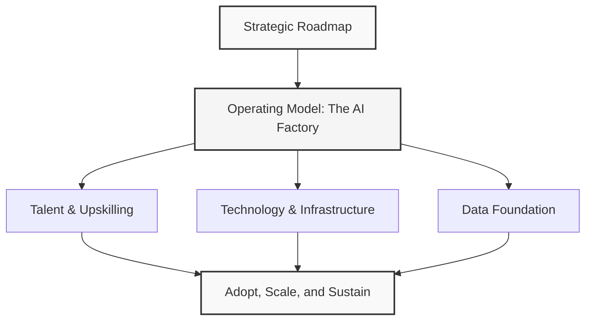
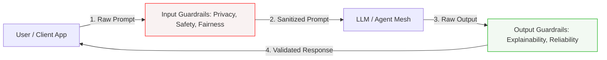

Here is the updated, highly structured version of the document, optimized for an enterprise AI Architect. All emojis have been removed, and the concepts have been synthesized using professional Mermaid diagrams.

---

## Context and Overview
Integrating Generative and Agentic AI at scale is not a tooling upgrade; it is a fundamental restructuring of the enterprise. To capture true business value, organizations must transition from isolated Proofs of Concept (PoCs) to a systemic, architected capability. 

Below is a rigorous restructuring of the McKinsey Rewired framework and Responsible AI Principles, mapped directly to architectural challenges with concrete, real-world enterprise examples.

---

## Enterprise AI Transformation: The Rewired Framework
To scale AI successfully, an organization must align six critical structural dimensions. For an AI Architect, this serves as the blueprint for designing scalable, secure, and highly integrated AI ecosystems.

### 1. Strategic Roadmap
*   **Definition:** A value-backed, phased execution plan prioritizing high-impact, feasible AI use cases over low-value experimentation.
*   **Architectural Focus:** Mapping business capabilities to the appropriate AI patterns (e.g., RAG, Fine-Tuning, Agentic workflows) based on complexity and ROI.
*   **Enterprise Example:** Instead of deploying generic chatbots across all departments, a financial institution builds a roadmap prioritizing Automated Underwriting Assistants (high value/medium complexity) in Phase 1, followed by Autonomous Portfolio Rebalancing Agents (high value/high complexity) in Phase 2.

### 2. Operating Model (The "AI Factory")
*   **Definition:** A centralized, cross-functional hub designed to standardize, build, test, and deploy AI capabilities at scale.
*   **Architectural Focus:** Transitioning from decentralized, siloed shadow IT to a centralized AI Center of Excellence (CoE) that provides reusable APIs, shared infrastructure, and standardized deployment pipelines (LLMOps).
*   **Enterprise Example:** Establishing a central AI Platform Team that manages a unified API gateway (e.g., Kong or Apigee) routing to various LLM providers (Azure OpenAI, AWS Bedrock), ensuring unified logging, rate-limiting, and cost-tracking across the entire conglomerate.

### 3. Technology & Infrastructure
*   **Definition:** The underlying systems, orchestration layers, and security guardrails that allow AI models and agents to interact safely.
*   **Architectural Focus:** Designing an Agent Mesh—a secure, event-driven architecture where autonomous agents communicate via standardized protocols while maintaining strict boundaries.
*   **Enterprise Example:** Implementing an enterprise service bus (like Kafka) where a Customer Support Agent can securely trigger a Billing Agent to process a refund, using OAuth 2.0 for agent-to-agent authentication and guardrails (like Llama Guard) to filter malicious payloads.

### 4. Data Foundation
*   **Definition:** A robust, enterprise-wide data fabric with high-performance search, retrieval, and strict governance.
*   **Architectural Focus:** Architecting enterprise-grade Vector Databases, Hybrid Search pipelines, and automated metadata tagging to feed Retrieval-Augmented Generation (RAG) systems with high-quality, real-time data.
*   **Enterprise Example:** Building a centralized Knowledge Graph integrated with a vector database (e.g., Pinecone or Milvus) that aggregates ERP, CRM, and SharePoint data, utilizing strict Role-Based Access Control (RBAC) so the AI agent only retrieves documents the querying user is authorized to see.

### 5. Talent & Upskilling
*   **Definition:** Redefining organizational roles and systematically upskilling the workforce to co-exist with and leverage AI.
*   **Architectural Focus:** Designing intuitive interfaces and low-code/no-code AI orchestration platforms that allow domain experts (non-developers) to safely configure agent behaviors.
*   **Enterprise Example:** Providing business analysts with a visual agent-builder interface (like Langflow or Flowise) pre-configured with enterprise-approved guardrails, allowing them to automate their own reporting workflows without writing Python code.

### 6. Adopt, Scale, and Sustain
*   **Definition:** Driving user adoption, monitoring model performance, maintaining human-in-the-loop (HITL) oversight, and tracking business value.
*   **Architectural Focus:** Implementing comprehensive LLMOps monitoring (tracking drift, latency, cost, and accuracy) and designing UI/UX patterns that force human validation for high-risk decisions.
*   **Enterprise Example:** An AI-driven medical coding system flags complex patient charts for manual review, providing a side-by-side UI showing the AI's reasoning and requiring a certified medical coder's signature before submitting the claim to insurance.

---

## Responsible AI: Architectural Principles
As an AI Architect, ethical principles must be translated into concrete technical constraints, guardrails, and system designs. 

The diagram below illustrates how these principles are enforced programmatically via an API Gateway pattern before and after the LLM interaction:

| **Principle** | **Architectural Translation** | **Enterprise Implementation Example** |
| :--- | :--- | :--- |
| **Transparency & Explainability** | Implement system traceability and clear UI indicators for AI-generated content. | Logging the exact system prompt, retrieved chunks (sources), and model temperature for every RAG query in an immutable audit log (e.g., Elasticsearch). |
| **Human Centricity & Control** | Design systems where AI acts as a copilot, leaving final execution authority to humans. | An AI agent drafts a marketing campaign budget, but the system prevents automated deployment if the budget exceeds 10,000 USD, requiring an API call to an approval workflow (e.g., Jira/ServiceNow). |
| **Accountability & Diligence** | Establish clear system ownership, version control, and fallback mechanisms. | Registering every deployed model and agent in an Enterprise Architecture repository (like LeanIX), mapping each to a business owner and a fallback static rule-based system. |
| **Reliability & Safety** | Build robust input/output validation layers to prevent prompt injection and hallucinations. | Deploying an intermediate gateway layer (e.g., NeMo Guardrails) that sanitizes user prompts before they reach the LLM and validates LLM outputs against known facts. |
| **Fairness & Bias Mitigation** | Implement systematic evaluation datasets and bias-detection pipelines. | Running automated evaluation suites (using tools like Ragas or TruLens) against diverse synthetic test datasets to measure demographic parity before deploying a hiring-assist tool. |
| **Privacy & Security** | Ensure data minimization, encryption in transit/at rest, and PII anonymization. | Integrating a PII-redaction microservice (e.g., Microsoft Presidio) into the data ingestion pipeline to strip out Social Security Numbers and emails before data is vectorized. |
| **Ethics & Sustainability** | Optimize compute efficiency and select models appropriate for the task complexity. | Routing simple classification tasks to small, energy-efficient local models (e.g., Llama-3-8B) and reserving larger, high-emission frontier models (e.g., GPT-4) only for complex reasoning. |
| **Adaptability & Compliance** | Decouple the application layer from specific LLM APIs to allow seamless model swapping. | Utilizing an abstraction layer (like LangChain or Semantic Kernel) so that if a model becomes non-compliant with new regulations, it can be swapped out with an alternative via a configuration change. |

---

## Architectural Takeaways
For an AI Architect in a large enterprise, the transition from experimentation to production requires focusing on three core architectural pillars:

1.  **Decouple the Stack:** Never hardcode your applications to a single LLM provider. Use API gateways and abstraction layers to ensure adaptability and cost control.
2.  **Govern the Data Fabric:** The quality of your AI is entirely dependent on your data. Invest heavily in Data Foundations (vector databases, metadata cataloging, and RBAC) before building complex agentic workflows.
3.  **Build Guardrails into the CI/CD:** Treat Responsible AI as a set of automated unit tests. Security, fairness, and safety checks must be integrated directly into your LLMOps deployment pipelines.