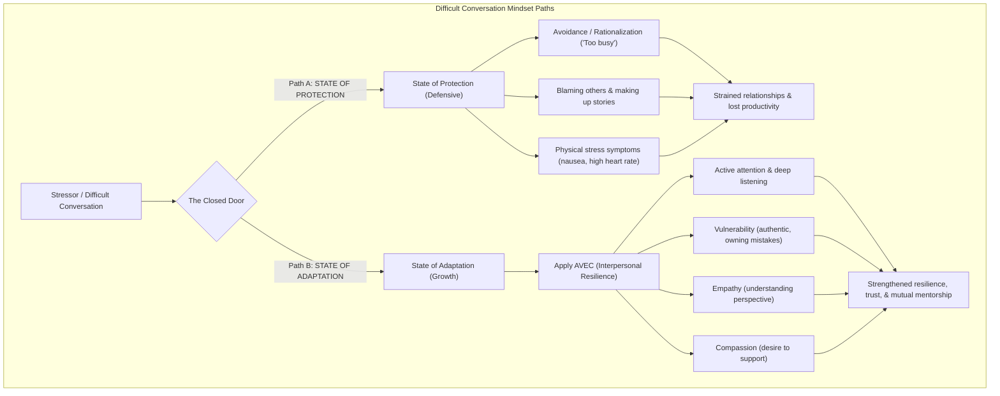

# Module 2 - Cultivating Strong Connections
*Lessons 11 & 12 of 29*

---

## Module 2: Learning Objectives
*   **Core Goal:** Establish strong, high-trust professional relationships by practicing the **AVEC** framework (Attention, Vulnerability, Empathy, and Compassion).

---

## Key Takeaways: Lecture Summary & Core Concepts

Interpersonal resilience is the foundation of individual well-being and collective team productivity. This module explores how to build and maintain high-quality connections, navigate difficult conversations, and leverage constructive conflict as a catalyst for mutual adaptation and growth.

### 1. The Secrets of Strong Connections
*   **The Ultimate Predictor of Longevity:** One of the longest-running longitudinal studies in human history shows that the biggest predictor of physical health, happiness, and cognitive longevity is the strength of our social connections. 
*   **The AVEC Framework:** Named after the French word for *"with"*, AVEC is a highly structured framework designed to build interpersonal resilience:
    *   **A** - Attention
    *   **V** - Vulnerability
    *   **E** - Empathy
    *   **C** - Compassion

> [!IMPORTANT]
> **Interpersonal Resilience is Collaborative:** Well-being is not a solitary pursuit. Achieving peak performance (the top of the Inverted U-curve) requires a psychological safety net built on mutual trust, clear boundaries, and empathetic communication.

---

### 2. The AVEC Framework in Practice
While these four components seem intuitive, the strength of a relationship depends on the *regularity* and *nuance* with which they are applied in everyday work interactions.

| Element | Definition | High-Impact Behaviors in Practice |
| :--- | :--- | :--- |
| **A - Attention** | Tuning into the other person literally and figuratively, listening deeply without distraction. | - Maintain eye contact to activate the social brain and parasympathetic nervous system. - Physically turn your body toward the speaker. - Listen actively and withhold premature judgment or the urge to immediately respond. |
| **V - Vulnerability** | Being your authentic self, stepping outside your comfort zone, and owning your mistakes. | - Acknowledge your fears, assumptions, or when you simply "don't know." - Accept responsibility for your role and assumptions in difficult situations. - Share honestly and openly how others' actions affect you. |
| **E - Empathy** | Seeking to understand and identify with the emotions and unique perspectives of others. | - Listen deeply to comprehend what the other person is experiencing. - Put yourself in their shoes without trying to "fix" their feelings immediately. - Validate their perspectives even if you disagree. |
| **C - Compassion** | Demonstrating genuine concern with an active, supportive intent to alleviate pain or help. | - Actively check in on colleagues to see how they are doing. - Invest dedicated time to respond in a meaningful, supportive way. - Offer practical help and support to show you want to be of service. |

---

### 3. AVEC in Action: Case Study of Bo & Svea
Many workplace relationship challenges stem from a mutual lack of AVEC, pushing colleagues into a defensive state of protection.

| Team Member | Traditional Behavior (State of Protection) | Reimagined Behavior (State of Adaptation with AVEC) |
| :--- | :--- | :--- |
| **Bo** | Lets mind wander, blurts out ideas, interrupts, and unconsciously co-opts Svea's ideas as his own. | Focuses his full **attention** on Svea, listens to her complete point of view, and asks clarifying questions. |
| **Svea** | Quick to judge, suppresses irritation, uses passive-aggressive body language, and eventually interrupts Bo back. | Shares her feelings and boundaries **vulnerably** and directly, fostering mutual **empathy** and a collaborative commitment to help one another. |

---

### 4. Difficult Conversations as Gateways to Growth
We often treat difficult conversations (e.g., tough performance reviews, constructive feedback, or team disputes) as threats. We either avoid them entirely or enter them with defensiveness. To build interpersonal resilience, we must shift our mindset from **Protection** to **Adaptation**.

> [!TIP]
> **Conflict as a Positive Force:** Conflict is not inherently negative. When approached with an open mind rather than judgment, defensiveness, or blame, conflict acts as a powerful source of learning. Disagreement exposes us to broader perspectives, helping teams adapt and solve challenges together.

> [!WARNING]
> **Feedback vs. Praise & Criticism:** Praise and criticism often trigger defensiveness and ego preservation. To enhance learning and psychological safety, replace judgment with **actionable feedback**—concrete observations and developmental ideas that colleagues can actively work on to grow.