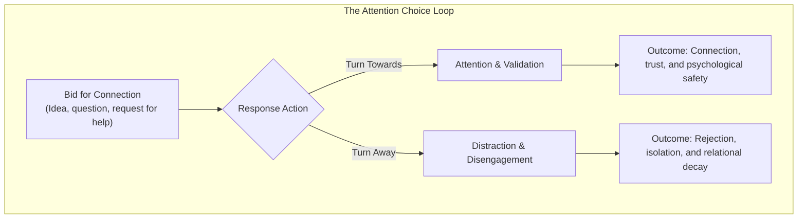

# Lesson 13 - Attention: The Foundation of Connection
*Lesson 13 of 29*

---

## Module 2: Cultivating Strong Connections
*   **Core Goal:** Master the art of presence by giving undivided, non-judgmental attention to build trust, foster psychological safety, and strengthen interpersonal relationships.

---

## Key Takeaways: Lecture Summary & Core Concepts

In communication, how we receive others is just as important as the message itself. This lesson focuses on the first letter of the **AVEC** framework: **Attention**. Deep attention acts as a bridge to connection, while distraction or dismissal signals rejection.

### 1. Bids for Connection & The Gottman Principle
*   **Bids for Connection:** Any gesture—verbal or physical—where one person attempts to connect with another (e.g., sharing an idea, asking a question, showing a physical reaction).
*   **The Turning Response:** Relationships succeed or fail based on how we respond to these bids:
    *   *Turning Towards:* Acknowledging, showing interest, and validating the bid.
    *   *Turning Away:* Ignoring, multi-tasking, or dismissing the bid.
*   **The Divorce Predictor:** Gottman Institute research highlights that turning away or ignoring bids for connection is the #1 predictor of divorce. In professional environments, the same principle dictates team trust, psychological safety, and collaboration quality.

> [!IMPORTANT]
> **Attention is the Currency of Connection:** Receiving someone without judgment triggers acceptance and a natural desire to connect. Even in fast-paced work settings, turning towards someone's bid—no matter how small—is a crucial building block of trust.

---

### 2. The Covey Listening Problem
Stephen Covey famously noted:
> "The biggest communication problem is we do not listen to understand. We listen to reply."

Often, while another person is speaking, our brain is busy formulating our next response, evaluating their points, or preparing counter-arguments. True attention requires pausing this internal commentary to focus entirely on understanding.

---

### 3. Tips for Your Next Conversation

To cultivate present, non-judgmental attention, divide your approach into preparation and active listening phases:

| Phase | Strategy | Practical Implementation |
| :--- | :--- | :--- |
| **In Preparation** | Prime your mind & environment | - **Practice Pausing:** Pause and adopt an open, curious mindset to be fully present. - **Envision Positive Outcomes:** See the conversation going right. - **Assess Energy & Time:** Ask yourself, *"Do I have the time and energy right now to give this conversation the attention it deserves?"* - **Minimize Distractions:** Turn off email/chat notifications, put away your phone, and choose a quiet workspace. |
| **During the Conversation** | Listen to understand, not to reply | - **Signal Attention Physically:** Turn your body towards them, maintain eye contact, and nod. - **Suppress the Urge to Reply:** Challenge yourself to listen silently without formulating responses in your head. - **Summarize to Validate:** Repeat back key points using their words to ensure you understood correctly. - **Suspend Evaluation:** Avoid judging or evaluating, even positively. Focus purely on understanding first. |

> [!TIP]
> **Suspending Judgment:** Try not to evaluate what the speaker is saying in the moment, even if your reaction is a positive one. You don't need to withhold your perspective forever, but prioritize understanding before introducing your own views.

---

### 4. Optional Practice: The Two-Minute Attention Challenge
Use this exercise to build active listening stamina with a colleague:

1.  **The Question:** Ask a colleague, *"How are you?"*
2.  **The Silence:** Listen fully and silently, without asking questions or interrupting, for **two minutes**. (If they respond with a standard *"I'm well,"* follow up with: *"How are you, really?"*).
3.  **The Reflection:** Take turns as the listener and responder. Debrief the experience:
    *   *As the listener:* How difficult was it to stay silent and not formulate replies?
    *   *As the responder:* How did it feel to have someone's complete, uninterrupted attention?