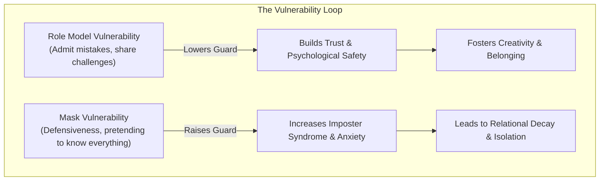

# Lesson 14 - Vulnerability
*Lesson 14 of 29*

---

## Key Takeaways: Lecture Summary & Core Concepts

This lesson focuses on the second letter of the **AVEC** framework: **Vulnerability**. It explores the paradox of vulnerability—how it is the very thing we seek in others but resist showing in ourselves—and its role in building high-trust teams.

### 1. The Paradox of Vulnerability
*   **The Approachability Signal:** Vulnerability is one of the first qualities we look for in others. It signals that someone is approachable, human, and open to connection.
*   **The Exposure Fear:** Despite seeking it in others, vulnerability is often the last thing we want to reveal about ourselves due to fear of judgment or weakness.
*   **Leadership Impact:** Role modeling vulnerability is critical for leaders. When those in power show vulnerability, it gives others permission to do the same, fostering an environment of creativity, inclusion, and psychological safety.

> [!IMPORTANT]
> **Brené Brown on Vulnerability:** 
> * *"Vulnerability is the core of shame and fear and our struggle for worthiness, but it appears that it’s also the birthplace of joy, of creativity, of belonging, of love."*
> * *"Vulnerability is not weakness; it's our greatest measure of courage."*

---

### 2. Tips for Practicing Vulnerability in Conversations

#### In Preparation
*   **Acknowledge Emotions:** Tune into your feelings without judgment to increase your self-awareness.
*   **Locate Discomfort:** Reflect on the topics or worries you are hesitant to reveal. Sit with this discomfort and investigate the "guards" you put up.
*   **Assess Safety & Boundaries:** Consider what you want to share and why. Remember to listen to your gut—it is okay to withhold sharing if you do not feel safe or comfortable.

#### During the Conversation
*   **Use "I" Statements:** Frame your experience around your own feelings, fears, and challenges (e.g., *"I feel anxious about..."*).
*   **State Intentions:** Clearly communicate your hopes for the conversation and the relationship.
*   **Acknowledge Your Role:** Take responsibility for your part in the situation, including any assumptions or misinterpretations (e.g., *"I realize I created anxiety by not communicating that decision earlier"*).

---

### 3. The Four Core Human Vulnerabilities
We generally experience vulnerability through one or more of these four common feelings:

| Vulnerability Type | Description | Key Questions to Ask Yourself |
| :--- | :--- | :--- |
| **Not Enough** | The fear of being wrong, lacking answers, imposter syndrome, or being "found out." | *Which of these feelings do I experience most frequently?*  *What impact does it have on my behavior and the people around me?* |
| **Not Belonging** | The fear of not being a valued part of the team, letting others down, or being misunderstood. | |
| **Not in Control** | The anxiety of being unable to fix a situation, help someone, or losing power/influence. | |
| **Not Mattering** | The feeling that your work or presence lacks purpose, significance, or impact. | |

> [!TIP]
> **Formative Reflection:** Think about where you come from and the experiences (e.g., parental or colleague influences) that shaped you. Understanding which of your strengths also act as weaknesses helps you navigate these four vulnerabilities.

---

### 4. Action Steps: Addressing Your Vulnerabilities
1.  **Identify:** Acknowledge the specific ways in which you feel vulnerable.
2.  **Script:** Imagine a upcoming situation where this vulnerability might arise. Write down exactly what it would sound like to share this vulnerability with others.
3.  **Evaluate:** Consider the potential outcome of sharing vs. keeping your guard up.