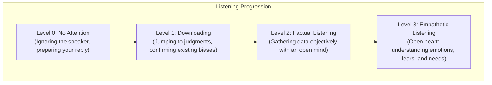

# Lesson 15 - Empathy
*Lesson 15 of 29*

---

## Key Takeaways: Lecture Summary & Core Concepts

This lesson focuses on the third letter of the **AVEC** framework: **Empathy**. It explores the connection between empathy and performance, defines the levels of active listening, and highlights empathy as a core skill for leadership and relationship building.

### 1. Empathy in Leadership & Relationships
*   **The Leadership Link:** Multiple studies demonstrate that empathy is a top competency for leadership, linked to superior performance and senior executive effectiveness.
*   **The Empathy Gap:** Despite its importance, empathy is low in business environments, with only 40% of business leaders possessing proficient empathy skills.
*   **The Catalyst for Change:** Empathy is a powerful tool to deepen interpersonal connections, fostering alignment and trust across any organizational role.

> [!IMPORTANT]
> **Carl Rogers on Empathy:** 
> *"We think we listen, but very rarely do we listen with real understanding, true empathy. Yet listening, of this very special kind, is one of the most potent forces for change that I know."*

---

### 2. The Four Levels of Listening
Empathy requires listening deeply, understanding someone else's perspective, and actively demonstrating that you have heard them—**without making their emotions your own** (maintaining healthy emotional boundaries). 

We can categorize listening behaviors into four progressive levels:

| Listening Level | Mindset & Focus | Typical Behaviors |
| :--- | :--- | :--- |
| **Level 0: No Attention** | Self-focused | Checking notifications, waiting for the other person to stop talking so you can speak. |
| **Level 1: Downloading** | Confirmation bias | Filtering out new information, jumping to judgments, and confirming what you already believe. |
| **Level 2: Factual Listening** | Open mind | Gathering data without immediate judgment, focusing on objective facts. |
| **Level 3: Empathetic Listening** | Open heart | Focusing on the speaker's emotional state, fears, and needs. Asking: *"What can I learn about this person's experience?"* |

---

### 3. Tips for Empathetic Conversations

To transition from analytical or distracted listening to empathetic connection, practice these steps:

#### In Preparation
*   **Set Your Intention:** Approach the conversation asking *"What can I learn?"* instead of *"How can I explain, convince, or fix this?"*
*   **Challenge Assumptions:** Consciously surface your biases. Assume good intentions and hold the other person in a positive light.

#### During the Conversation
*   **Listen Without Interrupting:** Suspend immediate judgment and stay curious about their story.
*   **Allow Emotional Resonance:** Be open to recognizing and feeling (not just intellectually understanding) some of the other person’s emotions.
*   **Play Back What You Hear:** Use verbal cues to show you understand their experience (e.g., *"What I’m sensing as I listen to you is..."* or *"It sounds like you felt..."*).

---

### 4. Optional Practice: Listening Self-Assessment
1.  **Reflect:** Review the four listening levels. Which level do you fall into most frequently during team meetings? What about during stressful 1-on-1s?
2.  **Seek Feedback:** Ask a trusted colleague or family member how they perceive you as a listener. Ask them: *"How could I demonstrate more empathy when we talk?"*