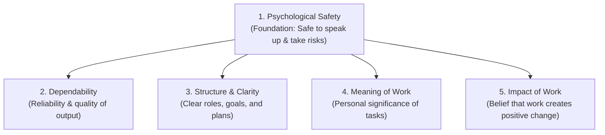

# Lesson 20 - Team Effectiveness
*Lesson 20 of 29*

---

## Core Insight: Group Dynamics Over Composition

In one of the largest studies on team performance (known as Google's Project Aristotle), Google researchers analyzed more than 180 teams to answer a fundamental question: **"What makes a team effective?"**

The core finding surprised many: **Who is on the team (composition) matters far less than how the team works together (dynamics).**

---

## The 5 Key Dynamics of Effective Teams

Google identified five essential dynamics that distinguish high-performing teams from others. They are ranked below in order of importance:

| Dynamic | Definition | Practical Meaning |
| :--- | :--- | :--- |
| **1. Psychological Safety** | The belief that the team is safe for interpersonal risk-taking. | Members feel comfortable speaking up, sharing ideas, admitting mistakes, and asking questions without fear of humiliation or punishment. |
| **2. Dependability** | The ability to rely on team members to deliver quality work on time. | Members execute tasks reliably, meet commitments, and maintain a high standard of excellence. |
| **3. Structure & Clarity** | Clear expectations, roles, and plans. | Members understand their individual roles, the team's goals, and the path to achieving them. |
| **4. Meaning of Work** | A sense of personal significance in the work. | The work is personally meaningful to each team member (e.g., financial security, self-expression, helping others). |
| **5. Impact of Work** | The belief that the work matters and creates change. | Members see a direct connection between their daily output and a broader, positive influence/goal. |

---

## The Foundation: Psychological Safety

Of the five dynamics, **Psychological Safety is by far the most important** and serves as the foundation underpinning the other four. Without a safe environment, teams cannot establish true dependability, clear alignment, or find deep meaning and impact in their work.

> [!IMPORTANT]
> **Psychological Safety is the Enabler:** When psychological safety is present, team members are more likely to admit mistakes, collaborate, take on new roles, and propose innovative ideas—which directly strengthens dependability, role clarity, meaning, and ultimate impact.