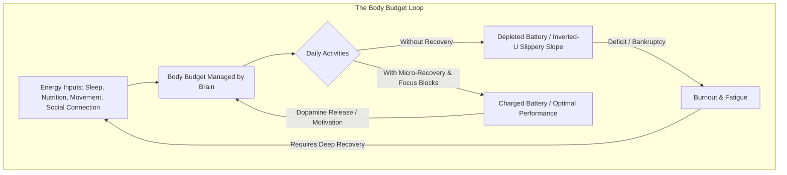

# Lesson 5 - What are the ingredients of well-being?
*Lesson 6 of 29*

---

## Key Takeaways: Lecture Summary & Core Concepts

Before diving into the detailed lecture contents, here are the key insights and concepts discussed:

### 1. The "Body Budget" & Well-Being Battery
*   **Energy Management:** Your brain manages your body's energy like a budget (the **"Body Budget"**, according to Dr. Lisa Feldman Barrett). 
*   **The Debt Limit:** You can run a deficit temporarily, but if not replenished, your body budget will eventually go bankrupt, leading to burnout.
*   **The Inverted U-Curve:** Well-being behaves like an inverted U-curve. Operating at extremes—either under-stimulation (boredom) or over-stimulation/stress (burnout)—drains your energy. Once you slip too far down either side, recovering gets exponentially harder.

> [!IMPORTANT]
> **Recovery is a Prerequisite, Not a Reward:** Your performance, cognitive bandwidth, and ability to learn are directly dependent on your battery charge. Recovery must be proactively scheduled rather than treated as a luxury.

### 2. Strategic Daily Recovery: Micro-Moments Over Intensity
*   **Continuous Recharging:** Maintaining your battery isn't about one large high-intensity break; it's about **weaving small moments of recovery** seamlessly throughout the day.
*   **The "Balanced Day" Blueprint:** 
    *   *Start:* Mindful waking (no screens for 20m) and daily intention setting.
    *   *Work:* Uninterrupted work blocks, movement intervals (every 2 hours), and walking meetings.
    *   *Evening:* Ruthless prioritization (productivity drops after 6-8 hours), non-negotiable personal connection, nightly gratitude, and digital disconnection 1 hour before bed.

### 3. The 3 Steps of the Well-Being Journey
Well-being is a progressive path. It is highly recommended to start with small, low-friction habits to trigger dopamine, which chemically reinforces motivation.

| Stage | Focus Area | Outcome / Indicator |
| :--- | :--- | :--- |
| **Step 1: The Basics** | Setting a foundation (more sleep, 20m movement daily, connection). | Enhanced ability to cope with daily stress. |
| **Step 2: Maintenance** | Conscious integration of recovery and emotional flexibility. | Stable well-being, avoiding the inverted U-curve drop-offs. |
| **Step 3: Mastery** | Proactive energy management, deep self-awareness of personal triggers. | Automatic adjustments, high resilience, and acting as a role model. |

> [!TIP]
> **The Power of Starting Small:** Don't try to build Step 3 mastery overnight. Setting micro-goals and achieving them releases dopamine, which chemically reinforces your motivation to sustain these new habits.

### 4. Implementing Feedback Loops
To avoid depletion before it's too late, use two main feedback mechanisms:
*   **Analog Feedback:** Soliciting active, honest feedback from colleagues, family, and mentors who can detect subtle changes in your energy or behavior.
*   **High-Tech Feedback:** Utilizing wearables to monitor biometric markers, specifically **Heart Rate Variability (HRV)**. Low HRV is a direct predictor of reduced resilience, cardiovascular risk, and impending burnout.
