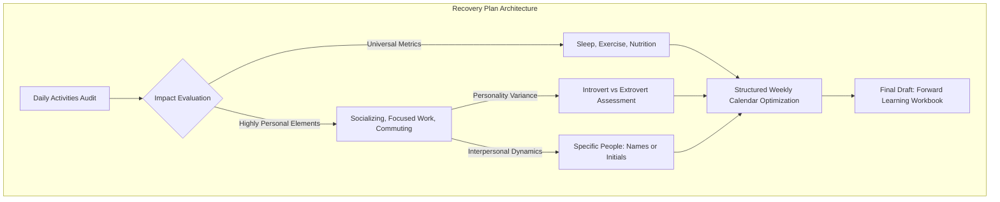

# Lesson 6 - How can you stay balanced?
*Lesson 7 of 29*

---

## Key Takeaways: Creating a Personalized Recovery Plan

A sustainable recovery plan depends on self-awareness and customization. While physical foundations are universal, psychological and social recovery are highly individual.

### 1. The Energy Mapping Framework
Every daily activity has a net positive (charge) or net negative (drain) impact on your personal well-being battery. Recovery planning requires auditing these activities systematically.

> [!IMPORTANT]
> **Universal vs. Personal Recovery:** Foundations like sleep, nutrition, and exercise are non-negotiable for everyone. However, mental, emotional, and social recovery depend entirely on your personality traits (e.g., introversion vs. extroversion).

### 2. Auditing Daily Activities
To build an effective recovery routine, evaluate the energy footprint of common professional and personal activities:

| Activity | Potential Energy Impact | Critical Variables to Assess |
| :--- | :--- | :--- |
| **Group & Zoom Meetings** | Typically draining due to cognitive load and screen fatigue | Duration, size of group, and active presentation requirements |
| **1:1 Meetings** | Variable (highly energizing or draining) | Interpersonal chemistry and the specific individuals involved |
| **Focused Individual Work** | High cognitive drain, but can induce flow states | Lack of interruptions, single-tasking capability |
| **Commuting** | Primarily draining due to environmental stress | Transit type, duration, and opportunity for decompression |
| **Social Interaction** | Energizing for extroverts; highly draining for introverts | Size of group, relationship depth, specific individuals |
| **Solitary Time / Alone Time** | Recharging for introverts; potentially isolating for extroverts | Quality of environment, lack of digital distractions |
| **Physical Movement** | Universally restorative if scaled to current energy | Intensity, setting (indoors vs. outdoors), and duration |

> [!TIP]
> **Detailing Interpersonal Dynamics:** Social activities are heavily influenced by the specific people involved. When drafting your recovery plan, list the names or initials of colleagues and friends to identify who replenishes your energy and who depletes it.

### 3. Actionable Planning & Implementation
*   **Identify Net Balance:** Compare the cumulative charges and drains of your typical day or week.
*   **Optimize Calendar Layout:** Restructure your schedule to insert restorative activities (such as physical movement or focused solitary breaks) immediately following high-drain tasks (such as extensive group meetings or commutes).
*   **Draft and Iterate:** Formalize your strategy in a tracking workbook using a structured template to establish an actionable, personalized battery-charging routine.

# Example recovery plan
