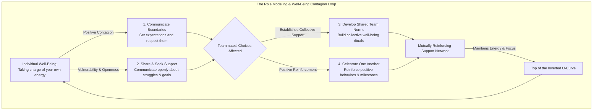

# Lesson 9 - The Importance of Role Modeling
*Lesson 9 of 29*

---

> "Your first and foremost job as a leader is to take charge of your own energy and then help to orchestrate the energy of those around you."
> 
> — **Peter Drucker**

---

## Key Takeaways: Lecture Summary & Core Concepts

This lecture highlights the social dimensions of well-being, emphasizing that personal energy management is not an isolated endeavor. Because human behaviors and emotions are naturally contagious, your choices directly shape the culture, habits, and resilience of your entire team.

### 1. The Power of Behavioral Contagion
*   **The Contagion Effect:** Empirical research demonstrates that well-being and stress are highly transmissible within organizational systems. Your physical, mental, and emotional state acts as a silent signal to those around you, influencing their behaviors and boundaries.
*   **Collective Resilience:** By proactively managing your own energy and staying at the top of the **Inverted U-Curve**, you help establish a supportive workspace where collective well-being is normalized and actively maintained.
*   **A Shared Responsibility:** Role modeling is not exclusive to formal leadership positions; every team member's choices contribute to creating a mutually reinforcing support network.

---

### 2. The Role Modeling & Contagion Loop
To understand how individual choices scale up to influence entire organizational cultures, we can trace the process through a reinforcing feedback loop:

> [!IMPORTANT]
> **Behavioral Contagion:** Our stress levels, energy, and work practices are highly contagious. Role modeling well-being is not a selfish act of self-care—it is an essential practice that gives colleagues implicit permission to manage their own energy.

---

### 3. The Four Pillars of Team Role Modeling
To transition from theory to practice, role modeling well-being can be broken down into four concrete pillars:

| Pillar of Role Modeling | Core Principle | Actionable Ideas & Implementation |
| :--- | :--- | :--- |
| **1. Set & Communicate Boundaries** | Establish and protect the structural conditions required to perform at your best. | - Clearly communicate stepping away, signing off, or periods of unavailability. - Respect your own rules: do not answer messages or emails during designated off-hours. - Ask teammates to actively challenge you if they notice you violating your own boundaries. |
| **2. Share & Seek Support** | Practice vulnerability to build psychological safety and trust. | - Share articles, podcasts, or resources on health and energy management with your team. - Initiate open conversations about what well-being lessons you are currently applying. - Vulnerably communicate your personal well-being goals and ask others for advice. |
| **3. Develop Team Norms** | Build collective rituals that make well-being the default, frictionless choice. | - Grant explicit, mutual permission to set and protect individual work boundaries. - Dedicate standing agenda time to discuss progress on personal goals (e.g., sleep quality, exercise, reading). - Utilize team messaging channels for quick, daily check-ins or sharing small wins. |
| **4. Celebrate One Another** | Actively reinforce positive well-being choices and recognize achievements. | - Dedicate regular meeting blocks to express appreciation or share gratitude. - Publicly congratulate teammates on personal, non-work achievements (e.g., finishing a race, attending family events). - Send direct, personalized notes of appreciation to show support. |

> [!TIP]
> **Vulnerability as a Leadership Catalyst:** True role modeling does not require presenting an image of perfect, effortless well-being. Sharing your challenges and asking for support is often the most powerful way to invite others to prioritize their own energy management.